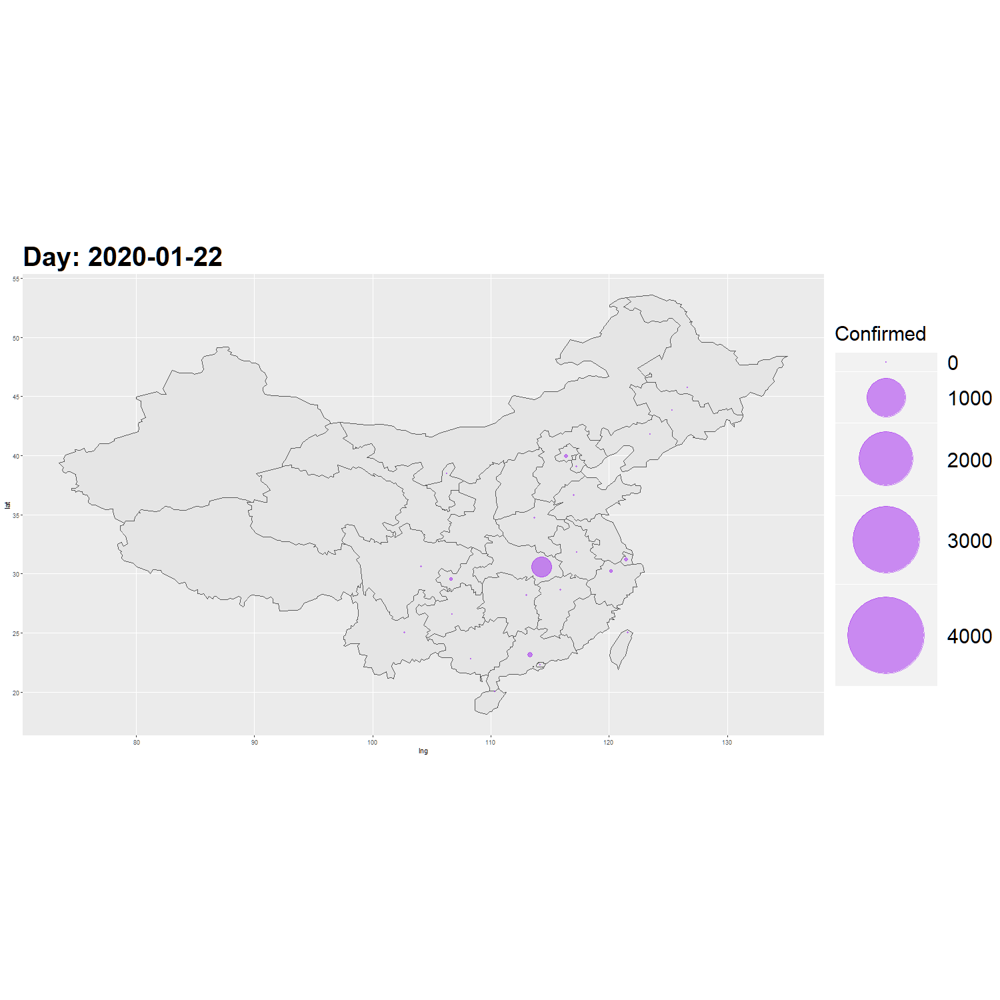
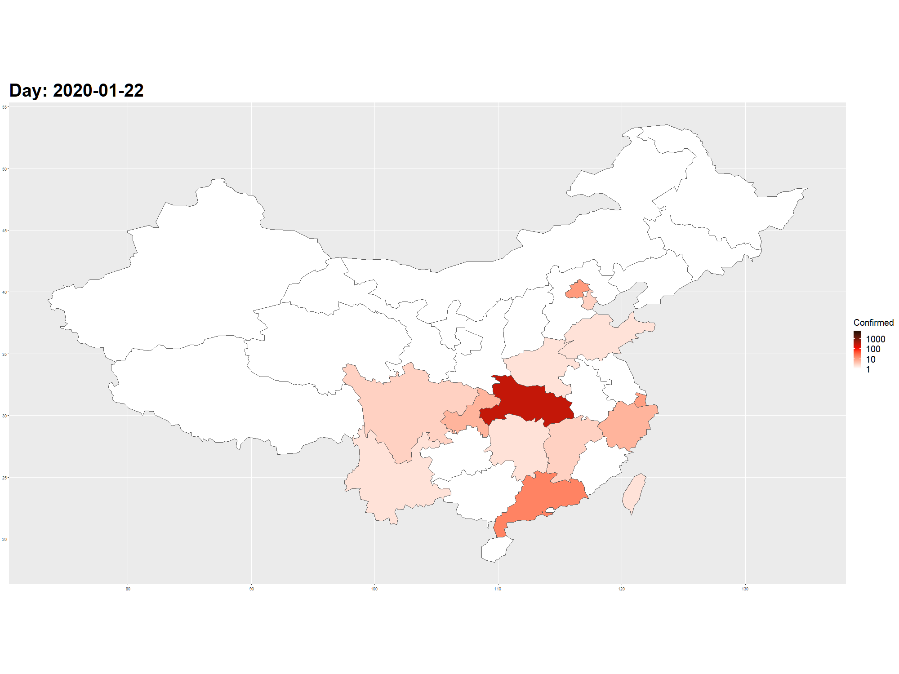

# 2019-nCoV

Visualizing and modeling the 2019-nCoV is the main objective here. The data are coming from [JHU nCov](#jhu-ncov). 

As I don't know anything about javascript, so I'm trying to use R to implement this idea. So the initial idea was to create an animated map with dots. Then I come into this [github](#2019-wuhan-ncov) and created similar plot within R.

## References: 
- [1] [some blog](http://boazsobrado.com/blog/2019/01/13/where-i-was-in-2018/)
- [2] [changing-ggplot-geom-sf-choropleth-fill-color](https://stackoverflow.com/questions/48288183/changing-ggplot-geom-sf-choropleth-fill-colors)
- [3](#2019-wuhan-ncov) [2019-wuhan-ncov](https://github.com/globalcitizen/2019-wuhan-coronavirus-data/)
- [4] [ggplot2-sf](https://www.r-spatial.org/r/2018/10/25/ggplot2-sf.html)
- [5] [cn-cities](https://simplemaps.com/data/cn-cities)
- [6](#jhu-ncov) [JHU nCov](https://systems.jhu.edu/research/public-health/ncov/)